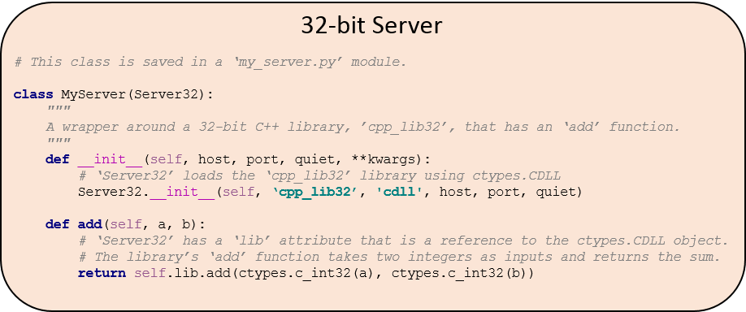
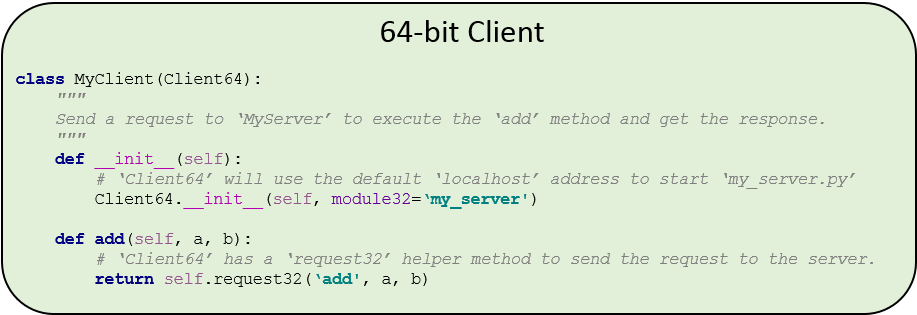

.. _tutorials:

============================================================
Tutorials: Access a 32-bit shared library from 64-bit Python
============================================================

These tutorials show you how you can use the :ref:`msl.loadlib <api>` package to access a 32-bit
shared library from a module that is running within a 64-bit Python interpreter. The procedure
implements a client-server protocol, as a type of `inter-process communication
<https://en.wikipedia.org/wiki/Inter-process_communication>`_, where the client is a subclass of
:class:`~msl.loadlib.client64.Client64` and the server is a subclass of
:class:`~msl.loadlib.server32.Server32`.

The following figures illustrate a minimal usage example. The **cpp_lib32.dll** file is a
32-bit C++ library that cannot be loaded from a module that is running within a 64-bit Python
interpreter. This library gets loaded by the **MyServer** class (that is a subclass of
:class:`~msl.loadlib.server32.Server32`) which is running within a 32-bit executable,
see :mod:`~msl.loadlib.start_server32`. **MyServer** hosts the library at the specified host
address and port number. Any class that is a subclass of :class:`~msl.loadlib.server32.Server32`
**MUST** provide three arguments in its constructor: ``host``, ``port`` and ``quiet``
(in that order). Otherwise the 32-bit executable cannot create an instance of the subclass.

**MyClient** is a subclass of :class:`~msl.loadlib.client64.Client64` which sends a request to
**MyServer** to call the ``add`` function in the shared library. **MyServer** processes the
request and sends the response back to **MyClient**.

The following tutorials are provided for communicating with different libraries that were
compiled in different programming languages or using different calling conventions:

.. toctree::

   "Dummy" example <tutorials_dummy>
   C++ library <tutorials_cpp>
   Windows stdcall library <tutorials_stdcall>
   FORTRAN library <tutorials_fortran>
   .NET Framework library <tutorials_dotnet>
