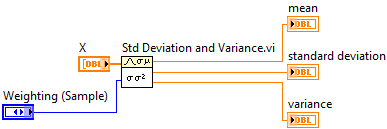

# LabVIEW  {: #direct-labview }

Load a 64-bit [LabVIEW]{:target="_blank"} library in 64-bit Python. An appropriate [LabVIEW Run-Time Engine]{:target="_blank"} must be installed. The [LabVIEW]{:target="_blank"} example is only valid on Windows. *To load the 32-bit library in 32-bit Python use `labview_lib32.dll` as the filename.*

!!! note
    A LabVIEW library can be built into a DLL using the `__cdecl` or `__stdcall` calling convention. Make sure that you specify the appropriate `libtype` when instantiating the
    [LoadLibrary][msl.loadlib.load_library.LoadLibrary] class for your LabVIEW library. The example library uses `__cdecl`.

## Example

Load the example [LabVIEW library][labview-lib]

<!-- invisible-code-block: pycon
>>> SKIP_IF_NOT_WINDOWS() or SKIP_IF_LABVIEW64_NOT_INSTALLED() or SKIP_IF_32BIT()

-->

```pycon
>>> from msl.loadlib import LoadLibrary
>>> from msl.examples.loadlib import EXAMPLES_DIR
>>> labview = LoadLibrary(EXAMPLES_DIR / "labview_lib64.dll")
>>> labview
<LoadLibrary libtype=CDLL path=...labview_lib64.dll>
>>> labview.lib
<CDLL '...labview_lib64.dll', handle ... at ...>

```

Create some data to calculate the mean, variance and standard deviation of

```pycon
>>> data = [1, 2, 3, 4, 5, 6, 7, 8, 9]

```

Convert `data` to a [ctypes][]{:target="_blank"} array and allocate memory for the parameters

```pycon
>>> from ctypes import c_double
>>> x = (c_double * len(data))(*data)
>>> mean, variance, std = c_double(), c_double(), c_double()

```

Calculate the sample standard deviation (i.e., the third argument is set to 0) and variance. Pass `mean`, `variance`, `std` by reference using [byref][ctypes.byref]{:target="_blank"} so that LabVIEW can write to the memory locations

```pycon
>>> from ctypes import byref
>>> ret = labview.lib.stdev(x, len(data), 0, byref(mean), byref(variance), byref(std))
>>> mean.value
5.0
>>> variance.value
7.5
>>> std.value
2.7386127875258306

```

Calculate the population standard deviation (i.e., the third argument is set to 1) and variance

```pycon
>>> ret = labview.lib.stdev(x, len(data), 1, byref(mean), byref(variance), byref(std))
>>> mean.value
5.0
>>> variance.value
6.666666666666667
>>> std.value
2.581988897471611

```

## LabVIEW Source Code {: #labview-lib }

??? example "labview_lib"

    === "labview_lib.vi"
        

    === "labview_lib.h"
        ```cpp
        --8<-- "src/msl/examples/loadlib/labview_lib.h"
        ```

[LabVIEW]: https://www.ni.com/en-us/shop/labview.html
[LabVIEW Run-Time Engine]: https://www.ni.com/en/support/downloads/software-products/download.labview-runtime.html
