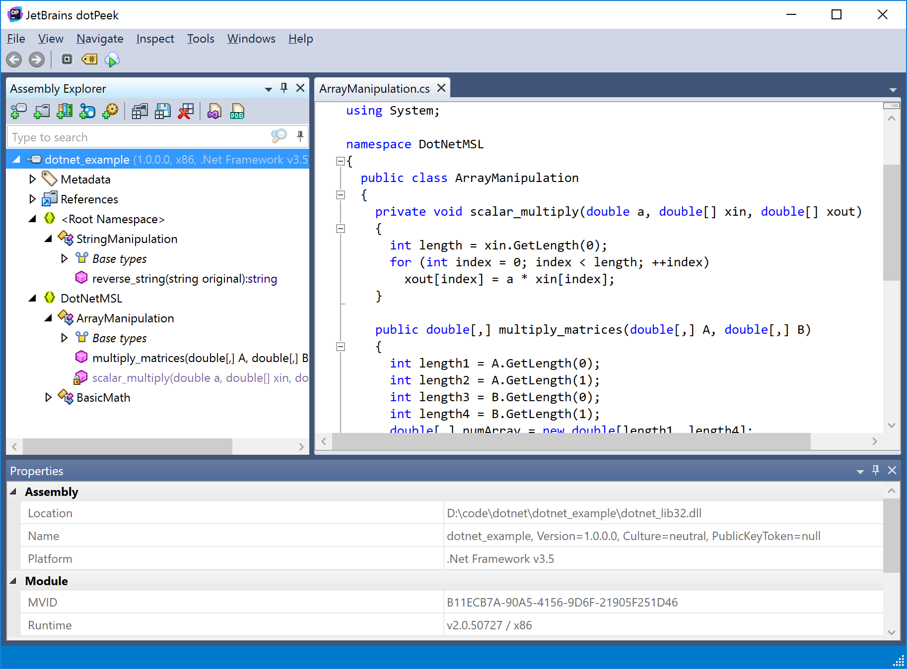

# .NET {: #ipc-dotnet }

This example shows how to access a 32-bit .NET library from 64-bit Python (Windows only &mdash; [Mono]{:target="_blank"} can load both 32-bit and 64-bit libraries on 64-bit Linux and therefore a 32-bit .NET library can be loaded directly via [LoadLibrary][msl.loadlib.load_library.LoadLibrary] on 64-bit Linux). [DotNet32][msl.examples.loadlib.dotnet32.DotNet32] is the 32-bit server and [DotNet64][msl.examples.loadlib.dotnet64.DotNet64] is the 64-bit client. The source code of the C# program is available [here][dotnet-lib].

??? tip "Decompile a .NET assembly"
    The [JetBrains dotPeek]{:target="_blank"} program can be used to decompile a .NET assembly. For example, *peeking* inside the example [dotnet_lib32.dll][dotnet-lib] library, that the [DotNet32][msl.examples.loadlib.dotnet32.DotNet32] class is a wrapper around, gives

    


??? note "Configure a .NET runtime"
    To configure `pythonnet` to use the .NET Core runtime, you must either run

    ```python
    from pythonnet import load
    load("coreclr")
    ```

    or define a `PYTHONNET_RUNTIME=coreclr` environment variable, e.g.,

    ```python
    import os
    os.environ["PYTHONNET_RUNTIME"] = "coreclr"
    ```

    before [super()][super]{:target="_blank"} is called in the [Server32][] subclass. To use the Mono runtime, replace `"coreclr"` with `"mono"`.

Create a [DotNet64][msl.examples.loadlib.dotnet64.DotNet64] client to communicate with the 32-bit [dotnet_lib32.dll][dotnet-lib] library

<!-- invisible-code-block: pycon
>>> SKIP_IF_NOT_WINDOWS() or SKIP_IF_WINDOWS_GITHUB_ACTIONS()

-->

```pycon
>>> from msl.examples.loadlib import DotNet64
>>> dn = DotNet64()

```

## Numeric types {: #ipc-cpp-numerics }

Add two integers, see [DotNet64.add_integers][msl.examples.loadlib.dotnet64.DotNet64.add_integers]

```pycon
>>> dn.add_integers(8, 2)
10

```

Divide two C# floating-point numbers, see [DotNet64.divide_floats][msl.examples.loadlib.dotnet64.DotNet64.divide_floats]

```pycon
>>> dn.divide_floats(3., 2.)
1.5

```

Multiple two C# double-precision numbers, see [DotNet64.multiply_doubles][msl.examples.loadlib.dotnet64.DotNet64.multiply_doubles]

```pycon
>>> dn.multiply_doubles(872.24, 525.525)
458383.926

```

Add or subtract two C# double-precision numbers, see [DotNet64.add_or_subtract][msl.examples.loadlib.dotnet64.DotNet64.add_or_subtract]

```pycon
>>> dn.add_or_subtract(99., 9., do_addition=True)
108.0
>>> dn.add_or_subtract(99., 9., do_addition=False)
90.0

```

## Arrays {: #ipc-dotnet-arrays }

Multiply a 1D array by a number, see [DotNet64.scalar_multiply][msl.examples.loadlib.dotnet64.DotNet64.scalar_multiply]

```pycon
>>> a = [float(val) for val in range(10)]
>>> a
[0.0, 1.0, 2.0, 3.0, 4.0, 5.0, 6.0, 7.0, 8.0, 9.0]
>>> dn.scalar_multiply(2.0, a)
[0.0, 2.0, 4.0, 6.0, 8.0, 10.0, 12.0, 14.0, 16.0, 18.0]

```

Multiply two matrices, see [DotNet64.multiply_matrices][msl.examples.loadlib.dotnet64.DotNet64.multiply_matrices]

```pycon
>>> m1 = [[1., 2., 3.], [4., 5., 6.]]
>>> m2 = [[1., 2.], [3., 4.], [5., 6.]]
>>> dn.multiply_matrices(m1, m2)
[[22.0, 28.0], [49.0, 64.0]]

```

## Strings {: #ipc-dotnet-strings }

Get the names of the classes in the .NET library module, see [DotNet64.get_class_names][msl.examples.loadlib.dotnet64.DotNet64.get_class_names]

```pycon
>>> dn.get_class_names()
['StringManipulation', 'StaticClass', 'DotNetMSL.BasicMath', 'DotNetMSL.ArrayManipulation']

```

Reverse a string, see [DotNet64.reverse_string][msl.examples.loadlib.dotnet64.DotNet64.reverse_string]

```pycon
>>> dn.reverse_string("New Zealand")
'dnalaeZ weN'

```

## Static Class {: #ipc-dotnet-static }

Call the static methods in the `StaticClass` class

```pycon
>>> dn.add_multiple(1, 2, 3, 4, 5)
15
>>> dn.concatenate("the", " experiment", " worked", False, " temporarily")
'the experiment worked'
>>> dn.concatenate("the", " experiment", " worked", True, " temporarily")
'the experiment worked temporarily'

```

You have access to the server's `stdout` and `stderr` streams when you shut down the server

```pycon
>>> stdout, stderr = dn.shutdown_server32()

```

[JetBrains dotPeek]: https://www.jetbrains.com/decompiler/
[Mono]: https://www.mono-project.com/download/stable/
